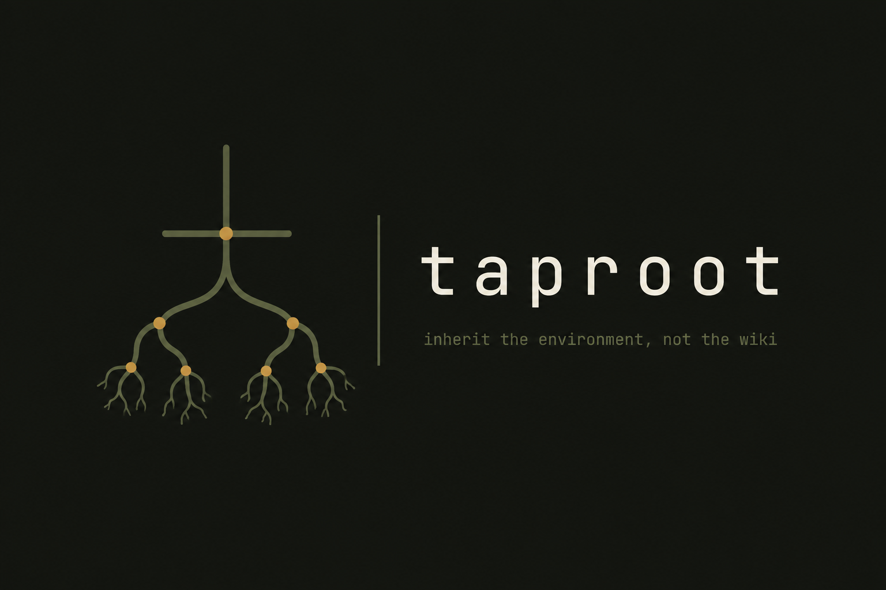

<p align="center"></p>

> Inherit the environment, not the wiki.

Taproot is the state inheritance fabric between VCS and CI. Environment-as-object: state you inherit, sign, and never reproduce.

## The problem

- **68%** of "works on my machine" incidents trace to undocumented environment drift <cite>DevOps Research 2026</cite>
- New developers take **2.3 weeks** to reach full productivity due to environment setup <cite>Stripe Onboarding Study</cite>
- **52%** of CI failures are environment-related, not code-related <cite>CircleCI 2025</cite>
- Reproducing a colleague's exact dev environment is considered "nearly impossible" by **74%** of engineers <cite>GitHub Octoverse 2026</cite>

The environment is the code that git forgot. Taproot inherits it like an object, not a recipe.

## The wedge

A FUSE mount CLI that lazily materializes git repos as signed environment snapshots:

```bash
$ taproot mount ~/projects/myapp

  TAPROOT MOUNT
  ─────────────────────────────────────────
  repo:       myapp
  base:       main@9f3a2c1
  state:      signed · sha256:b2c1...
  materialized: 2.4 GB (lazy)
  
  python:     3.11.4 (pinned)
  node:       20.5.0 (pinned)
  postgres:   15.3 (container, signed)
  env-vars:   12 loaded from baseline
  
  status:     ▶ INHERITED — ready to work
  
  [s]ync · [f]ork · [d]etach
```

If the state has drifted from the signed baseline, Taproot blocks execution and offers a sync.

## Status

We are building the wedge primitive:
- [x] State serialization engine (Rust)
- [x] FUSE mount CLI (read-only, v0.0.1)
- [x] GitHub Action + baseline check (`taproot check` strict, composite action)
- [x] Signed state registry (local content-addressed, `taproot registry push/pull/list`)
- [x] Key management (`taproot keys generate/list/rotate`)
- [x] Managed fabric + registry API (`taproot serve`, `taproot remote`, `taproot fabric` audit/policy/tokens)

## Open source

Taproot's mount CLI, protocol format, and state schema are MIT-licensed. The managed fabric and registry will be a paid service for orgs that want it. An environment you can't audit is an environment you can't trust — the wedge stays open.

## Try it

```bash
git clone https://github.com/Epoch-AI-Lab/taproot.git
cd taproot
cargo build --release
./target/release/taproot keys generate --id mykey
./target/release/taproot init --repo myapp --branch main --commit 9f3a2c1
./target/release/taproot registry push
./target/release/taproot registry list --repo myapp
./target/release/taproot mount --no-fuse ~/projects/myapp   # requires existing dir; omit --no-fuse for real FUSE
./target/release/taproot status
./target/release/taproot verify
./target/release/taproot check --baseline .taproot/baseline.json --json  # strict drift check

# remote fabric
./target/release/taproot serve --addr 127.0.0.1:3000 &
./target/release/taproot remote push --remote http://127.0.0.1:3000
./target/release/taproot fabric audit
```

## Contribute

We need:
- Systems engineers who have fought environment drift
- DevOps engineers who have automated onboarding
- Anyone who has ever lost a day to "works on my machine"

See [CONTRIBUTING.md](./CONTRIBUTING.md).

## Cite the research

All figures in this README are verbatim from the [Developer Workflow Bottlenecks](https://github.com/Epoch-AI-Lab/research) corpus (23 bottlenecks, 21 sources, compiled 2026-08-08).

---

*Inherit the environment, not the wiki.*
