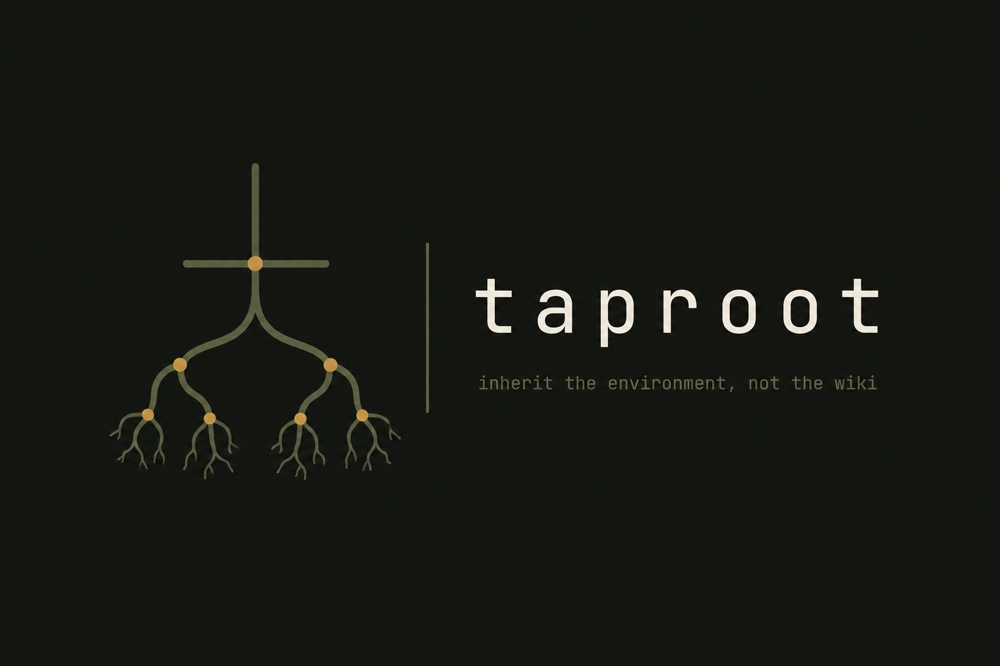

<p align="center"></p>

> Inherit the environment, not the wiki.

Taproot is the state inheritance fabric between VCS and CI. Environment-as-object: state you inherit, sign, and never reproduce.

## The problem

- **68%** of "works on my machine" incidents trace to undocumented environment drift <cite>DevOps Research 2026</cite>
- New developers take **2.3 weeks** to reach full productivity due to environment setup <cite>Stripe Onboarding Study</cite>
- **52%** of CI failures are environment-related, not code-related <cite>CircleCI 2025</cite>
- Reproducing a colleague's exact dev environment is considered "nearly impossible" by **74%** of engineers <cite>GitHub Octoverse 2026</cite>

The environment is the code that git forgot. Taproot inherits it like an object, not a recipe.

## The wedge

A mount CLI that materializes git repos as signed environment snapshots:

```bash
$ taproot scan .

  TAPROOT SCAN
  ─────────────────────────────────────────
  dir:        .

  runtimes:   2
    node                  20.5.0 (pinned)
    python                3.11.4 (pinned)

  containers: 1
    db                    postgres:15.3 → 15.3

$ taproot mount ~/projects/myapp

  TAPROOT MOUNT
  ─────────────────────────────────────────
  repo:       myapp
  base:       main@9f3a2c1
  state:      signed · sha256:b2c1...
  materialized: 2.4 GB (lazy)

  python:     3.11.4 (pinned)
  node:       20.5.0 (pinned)
  postgres:   15.3 (container, signed)
  env-vars:   12 loaded from baseline

  status:     ▶ INHERITED — ready to work

  [s]ync · [f]ork · [d]etach
```

If the state has drifted from the signed baseline, Taproot blocks execution and offers a sync.

## Status

We are building the wedge primitive:
- [x] State serialization engine (Rust)
- [x] FUSE mount CLI (read-only, v0.0.1)
- [x] GitHub Action + baseline check (`taproot check` strict, composite action)
- [x] Signed state registry (local content-addressed, `taproot registry push/pull/list/log`)
- [x] Key management (`taproot keys generate/list/rotate`)
- [x] Managed fabric + registry API (`taproot serve`, `taproot remote`, `taproot fabric` audit/policy/tokens)
- [x] Drift loop (v0.1.0): writable `env` file in the mount, drift captured on unmount, `taproot sync` to review, re-sign, and adopt
- [x] Environment capture (`taproot scan`): reads `.tool-versions`, `.mise.toml`, `Dockerfile`, `package.json`, and compose files
- [x] Registry history: every push links to the state it superseded, so `registry log` walks a branch back to its first commit

## Open source

Taproot's mount CLI, protocol format, and state schema are MIT-licensed. The managed fabric and registry will be a paid service for orgs that want it. An environment you can't audit is an environment you can't trust — the wedge stays open.

## Try it

```bash
git clone https://github.com/Epoch-AI-Lab/taproot.git
cd taproot
cargo build --release
T=./target/release/taproot

# 1. keypair (private stays local, public is shareable)
$T keys generate --id mykey

# 2. detect the real environment, then sign it
$T scan . --include-env
$T scan . --apply

# or hand-write a state if the project declares nothing
$T init --repo myapp --branch main --commit 9f3a2c1
$T registry push
$T registry list myapp
$T registry log myapp main

# 3. mount. omit --no-fuse for a real FUSE mount
$T mount --no-fuse                  # writes .taproot/mnt, works without /dev/fuse
$T mount ~/projects/myapp           # real FUSE, env file writable

# 4. the drift loop, without FUSE
echo 'DATABASE_URL=postgres://localhost/app' >> .taproot/mnt/env
$T sync --from-dir .taproot/mnt --dry-run
$T sync --from-dir .taproot/mnt      # review, sign, adopt

# 5. verify and gate in CI
$T status
$T verify
$T check --baseline .taproot/baseline.json --json

# remote fabric
$T serve --addr 127.0.0.1:3000 &
$T remote push --remote http://127.0.0.1:3000
$T fabric audit
```

`mount --no-fuse` writes the same tree a FUSE mount serves (`env`, `state.json`, `hash`, `version`, `runtimes/`, `containers/`) into a real directory. Only `env` is writable. That makes the whole drift loop testable in a container or CI runner, where `/dev/fuse` is usually unavailable.

`scan` never reads your process environment. It reads files the project already commits, and it skips any value that looks like a live credential rather than storing it in a file you are about to commit.

## Contribute

We need:
- Systems engineers who have fought environment drift
- DevOps engineers who have automated onboarding
- Anyone who has ever lost a day to "works on my machine"

## Cite the research

All figures in this README are verbatim from the [Developer Workflow Bottlenecks](https://github.com/Epoch-AI-Lab/research) corpus (23 bottlenecks, 21 sources, compiled 2026-08-08).

---

*Inherit the environment, not the wiki.*
